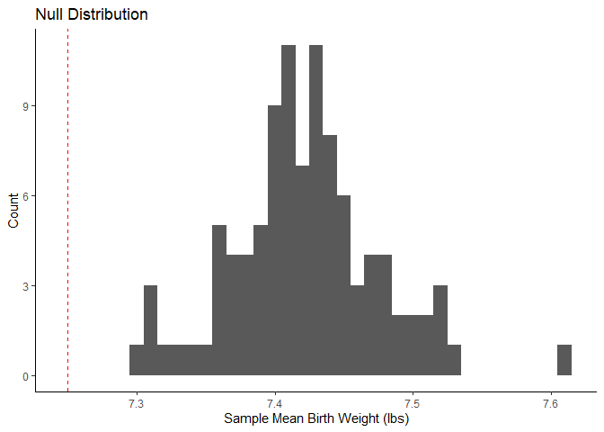
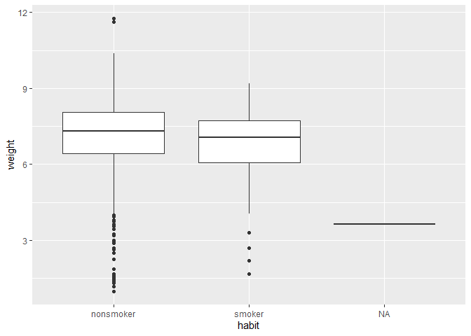

Lab 12 - Smoking during pregnancy
================
Ben Waggener
4/11/2025

### Load packages and data

``` r
library(tidyverse) 
```

    ## Warning: package 'tidyverse' was built under R version 4.4.3

    ## Warning: package 'ggplot2' was built under R version 4.4.3

    ## Warning: package 'purrr' was built under R version 4.4.3

``` r
library(tidymodels)
```

    ## Warning: package 'tidymodels' was built under R version 4.4.3

    ## Warning: package 'broom' was built under R version 4.4.3

    ## Warning: package 'dials' was built under R version 4.4.3

    ## Warning: package 'infer' was built under R version 4.4.3

    ## Warning: package 'modeldata' was built under R version 4.4.3

    ## Warning: package 'parsnip' was built under R version 4.4.3

    ## Warning: package 'recipes' was built under R version 4.4.3

    ## Warning: package 'rsample' was built under R version 4.4.3

    ## Warning: package 'tune' was built under R version 4.4.3

    ## Warning: package 'workflows' was built under R version 4.4.3

    ## Warning: package 'workflowsets' was built under R version 4.4.3

    ## Warning: package 'yardstick' was built under R version 4.4.3

``` r
library(openintro)
```

    ## Warning: package 'openintro' was built under R version 4.4.3

    ## Warning: package 'airports' was built under R version 4.4.3

    ## Warning: package 'cherryblossom' was built under R version 4.4.3

    ## Warning: package 'usdata' was built under R version 4.4.3

setting a seed for reproducibility

``` r
set.seed(04102025)
```

loading data

``` r
ncbirths <- openintro::ncbirths
```

### Exercise 1

cases are individual births such that it includes information aboout the
child, the mother, and the father. There are 1000 cases in this sample.

### Exercise 2

filter to keep only the white mothers

Mean weight of babies from white moms : 7.25

``` r
ncbirths_white <- ncbirths %>%
  filter(whitemom == "white")

summary(ncbirths_white)
```

    ##       fage            mage               mature        weeks      
    ##  Min.   :14.00   Min.   :15.00   mature mom :103   Min.   :22.00  
    ##  1st Qu.:26.00   1st Qu.:23.00   younger mom:611   1st Qu.:38.00  
    ##  Median :31.00   Median :27.50                     Median :39.00  
    ##  Mean   :30.69   Mean   :27.65                     Mean   :38.51  
    ##  3rd Qu.:35.00   3rd Qu.:32.00                     3rd Qu.:40.00  
    ##  Max.   :50.00   Max.   :50.00                     Max.   :45.00  
    ##  NA's   :77                                        NA's   :2      
    ##        premie        visits            marital        gained     
    ##  full term:616   Min.   : 0.0   not married:203   Min.   : 0.00  
    ##  premie   : 96   1st Qu.:10.0   married    :510   1st Qu.:22.00  
    ##  NA's     :  2   Median :12.0   NA's       :  1   Median :30.00  
    ##                  Mean   :12.3                     Mean   :30.98  
    ##                  3rd Qu.:15.0                     3rd Qu.:40.00  
    ##                  Max.   :30.0                     Max.   :85.00  
    ##                  NA's   :4                        NA's   :20     
    ##      weight      lowbirthweight    gender          habit          whitemom  
    ##  Min.   : 1.00   low    : 68    female:367   nonsmoker:617   not white:  0  
    ##  1st Qu.: 6.63   not low:646    male  :347   smoker   : 96   white    :714  
    ##  Median : 7.44                               NA's     :  1                  
    ##  Mean   : 7.25                                                              
    ##  3rd Qu.: 8.13                                                              
    ##  Max.   :11.75                                                              
    ## 

``` r
obs_mean <- ncbirths_white %>%
  summarize(mean_weight = mean(weight)) 
```

### Exercise 3

the criteria for conducting simulation-based inference are satisfied.
The data has a lot of observations (1000), they are randomly sampled,
and these observations are independent of each other.

\##Exercise 4 H0:μ=7.43 poundsH0:μ=7.43 pounds. HA:μ≠7.43
poundsHA:μ≠7.43 pounds.

There were 0 bootstrapped samples with the null distribution wiht a mean
at or lower than 7.25 (p \< .05). This means that it is highly unlikely
that the mean birth weight in 1995 was the same as it is now, they are
significantly different.

``` r
sim_ncbirth_white <- ncbirths_white %>%
  specify(response = weight) %>%
  generate(reps = 100, type = "bootstrap") %>%
  calculate(stat = "mean")
summary(sim_ncbirth_white)
```

    ##    replicate           stat      
    ##  Min.   :  1.00   Min.   :7.120  
    ##  1st Qu.: 25.75   1st Qu.:7.213  
    ##  Median : 50.50   Median :7.242  
    ##  Mean   : 50.50   Mean   :7.243  
    ##  3rd Qu.: 75.25   3rd Qu.:7.271  
    ##  Max.   :100.00   Max.   :7.434

``` r
obs_mean_value <- obs_mean$mean_weight

# Calculate shift value
shift_amount <- obs_mean_value - 7.43

# Shift bootstrap distribution
null_dist <- sim_ncbirth_white %>%
  mutate(stat = stat - shift_amount)
```

``` r
ggplot(null_dist, mapping = aes(x = stat))+
  geom_histogram(binwidth = .01)+
  geom_vline(xintercept = 7.25, color = "red", linetype = "dashed") +
  labs(
    title = "Null Distribution",
    x = "Sample Mean Birth Weight (lbs)",
       y = "Count")+
  theme_classic()
```

<!-- -->

``` r
null_dist %>%
  filter(stat <= (7.25)) %>%
  summarize(p_value = n()/nrow(null_dist))
```

    ## # A tibble: 1 × 1
    ##   p_value
    ##     <dbl>
    ## 1       0

``` r
p_value <- null_dist %>%
  get_p_value(obs_stat = obs_mean_value, direction = "two_sided")
```

    ## Warning: Please be cautious in reporting a p-value of 0. This result is an approximation
    ## based on the number of `reps` chosen in the `generate()` step.
    ## ℹ See `get_p_value()` (`?infer::get_p_value()`) for more information.

``` r
p_value
```

    ## # A tibble: 1 × 1
    ##   p_value
    ##     <dbl>
    ## 1       0

\##Exercise 5

This plot shows that smoking reduces the childs weight compared to not
smoking. Also there seems to be a lot of variability in the non smoking
data.

``` r
ggplot(ncbirths, aes(x = habit, y = weight)) +
  geom_boxplot()
```

<!-- -->

\##Exercise 6

``` r
ncbirths_clean <- ncbirths %>%
  filter(!is.na(habit)) %>%
  filter(!is.na(weight)) 
```

\##Exercise 7

``` r
ncbirths_clean %>%
  group_by(habit) %>%
  summarize(mean_weight = mean(weight),
  sd_weight = sd(weight))
```

    ## # A tibble: 2 × 3
    ##   habit     mean_weight sd_weight
    ##   <fct>           <dbl>     <dbl>
    ## 1 nonsmoker        7.14      1.52
    ## 2 smoker           6.83      1.39

\##Exercise 8 H0:weight of smoker = weight of nonsmoker (mother) HA:
weight of smoker ≠ weight of nonsmoker (mother)

\##Exercise 9

run a t test to evaluate the hypothesis

``` r
t.test(weight ~ habit, data = ncbirths_clean)
```

    ## 
    ##  Welch Two Sample t-test
    ## 
    ## data:  weight by habit
    ## t = 2.359, df = 171.32, p-value = 0.01945
    ## alternative hypothesis: true difference in means between group nonsmoker and group smoker is not equal to 0
    ## 95 percent confidence interval:
    ##  0.05151165 0.57957328
    ## sample estimates:
    ## mean in group nonsmoker    mean in group smoker 
    ##                7.144273                6.828730

these are statistically significant

\#Exercise 10

make confidence intervals for each group

``` r
ncbirths_clean %>%
  group_by(habit) %>%
  summarize(mean_weight = mean(weight),
            sd_weight = sd(weight),
            n = n()) %>%
  mutate(se = sd_weight/sqrt(n),
         lower_ci = mean_weight - qt(0.975, df = n-1) * se,
         upper_ci = mean_weight + qt(0.975, df = n-1) * se)
```

    ## # A tibble: 2 × 7
    ##   habit     mean_weight sd_weight     n     se lower_ci upper_ci
    ##   <fct>           <dbl>     <dbl> <int>  <dbl>    <dbl>    <dbl>
    ## 1 nonsmoker        7.14      1.52   873 0.0514     7.04     7.25
    ## 2 smoker           6.83      1.39   126 0.123      6.58     7.07

Yippie

\#Exercise 11

“First, a non-inference task: Determine the age cutoff for younger and
mature mothers. Use a method of your choice, and explain how your method
works.”

the cuttoff for younger moms is at 34 and for mature moms is 50 I just
got the min and max of the age ranges after grouping them by the mature
variable

``` r
ncbirths_clean %>%
  group_by(mature) %>%
  summarize(
    mean_mage = mean(mage, na.rm = TRUE),
    min_mage = min(mage, na.rm = TRUE),
    max_mage = max(mage, na.rm = TRUE)
  )
```

    ## # A tibble: 2 × 4
    ##   mature      mean_mage min_mage max_mage
    ##   <fct>           <dbl>    <int>    <int>
    ## 1 mature mom       37.2       35       50
    ## 2 younger mom      25.4       13       34

\#Exercise 12 “Conduct a hypothesis test evaluating whether the
proportion of low birth weight babies is higher for mature mothers. Use
α = 0.05.”

The null hypothesis is that there is no difference between the
proportion of low birth weights between mature and younger mothers The
alternative hypothesis is that there is a difference between the
proportion of low birth weights between mature and younger mothers.

(use lowbirthweight variable)

``` r
ncbirths_clean %>%
  count(mature, lowbirthweight) %>%
  group_by(mature) %>%
  mutate(p_hat = n / sum(n))
```

    ## # A tibble: 4 × 4
    ## # Groups:   mature [2]
    ##   mature      lowbirthweight     n p_hat
    ##   <fct>       <fct>          <int> <dbl>
    ## 1 mature mom  low               17 0.129
    ## 2 mature mom  not low          115 0.871
    ## 3 younger mom low               93 0.107
    ## 4 younger mom not low          774 0.893

``` r
null_dist <- ncbirths_clean %>%
  specify(response = lowbirthweight, 
          explanatory = mature, 
          success = "low") %>%
  hypothesize(null = "independence") %>%
  generate(100, type = "permute") %>%
calculate(stat = "diff in props", order = c("mature mom", "younger mom"))

head(null_dist)
```

    ## Response: lowbirthweight (factor)
    ## Explanatory: mature (factor)
    ## Null Hypothesis: independence
    ## # A tibble: 6 × 2
    ##   replicate     stat
    ##       <int>    <dbl>
    ## 1         1  0.0390 
    ## 2         2 -0.00467
    ## 3         3  0.00406
    ## 4         4  0.00406
    ## 5         5 -0.00467
    ## 6         6 -0.0134

``` r
observed_stat <- ncbirths_clean %>%
  group_by(mature) %>%
  summarize(prop_low_birth_weight = mean(lowbirthweight == "low")) %>%
  spread(mature, prop_low_birth_weight) %>%
  mutate(diff_in_props = `mature mom` - `younger mom`) %>%
  pull(diff_in_props)

observed_stat
```

    ## [1] 0.02152144

null hypothesis is rejected, meaning that the proportion of low birth
weights are different between younger and mature moms with mature moms
having a significantly greater amount of low birth weights.

\#Exercise 13
